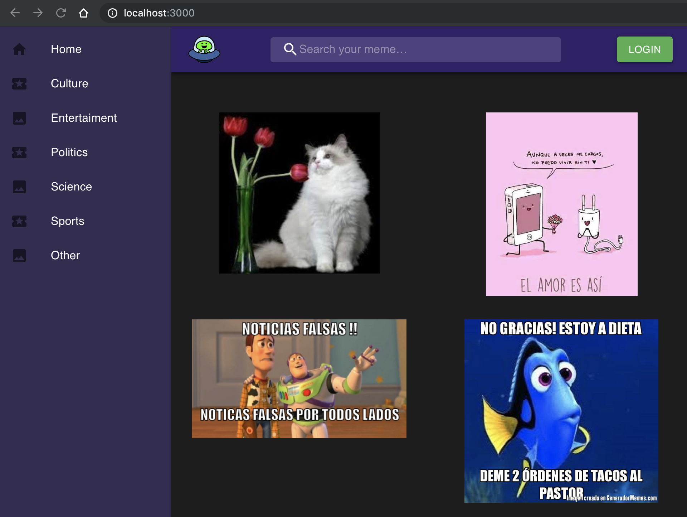
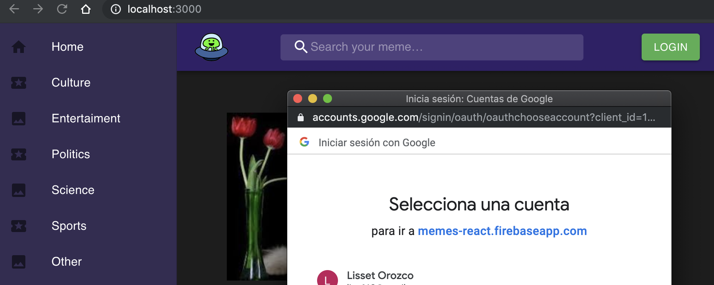
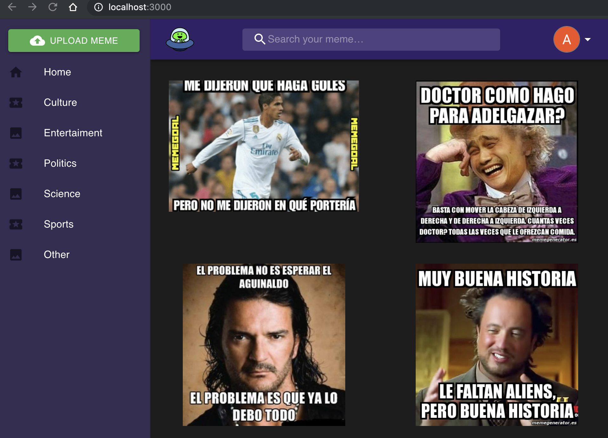
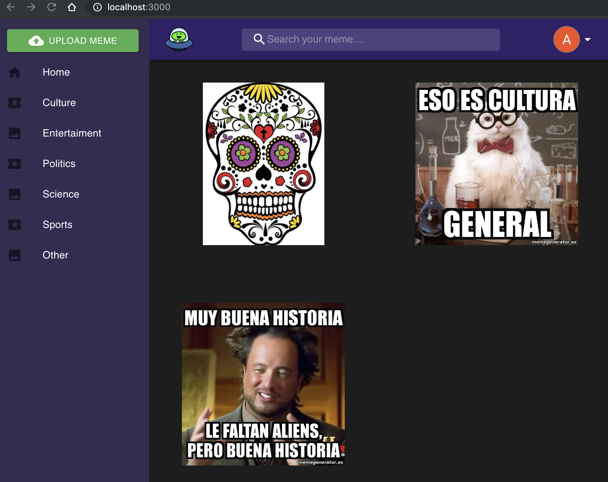
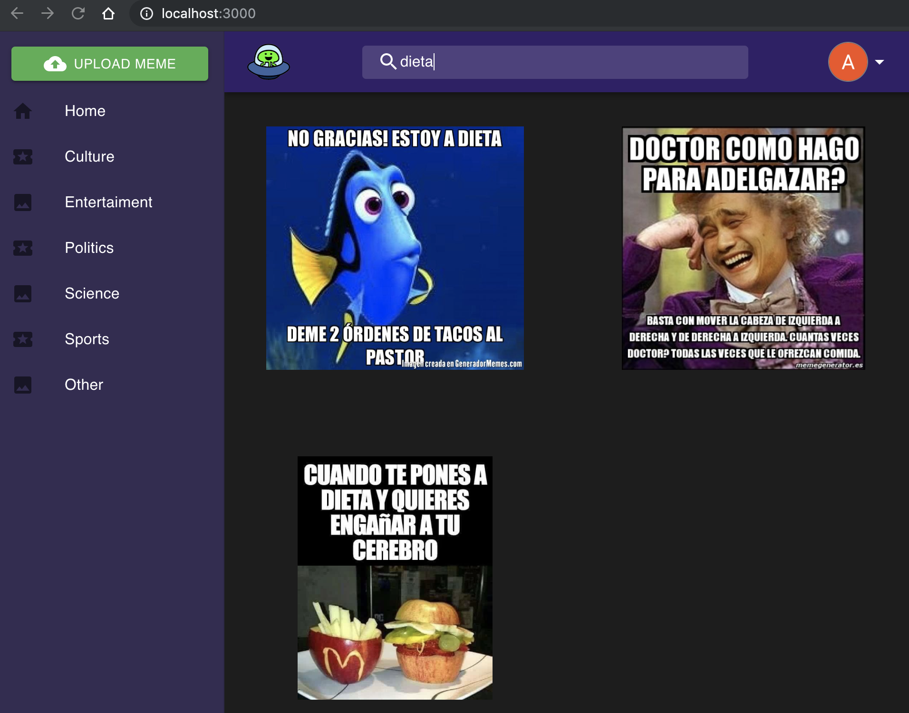
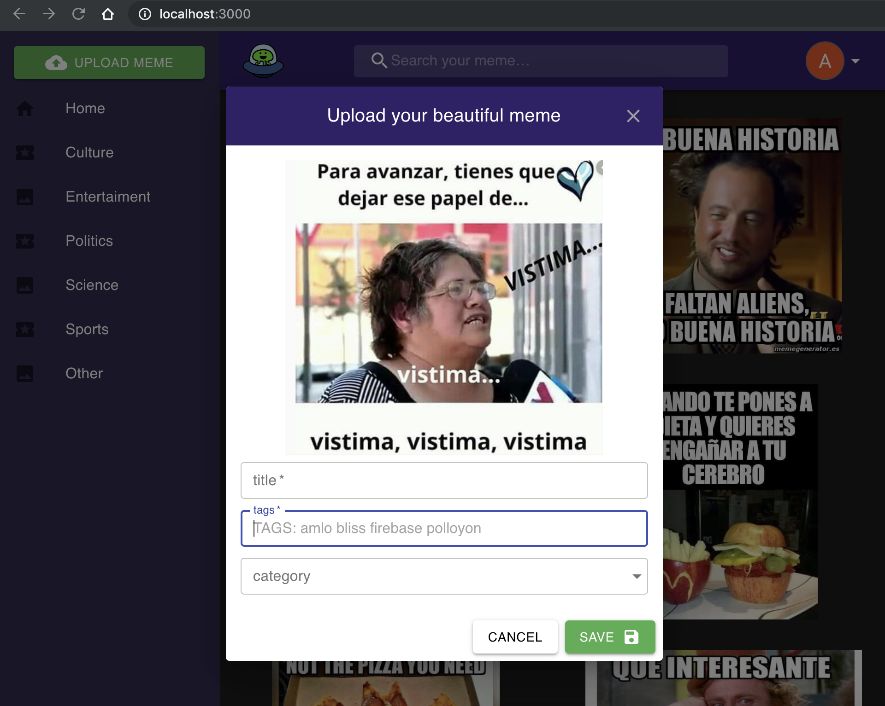
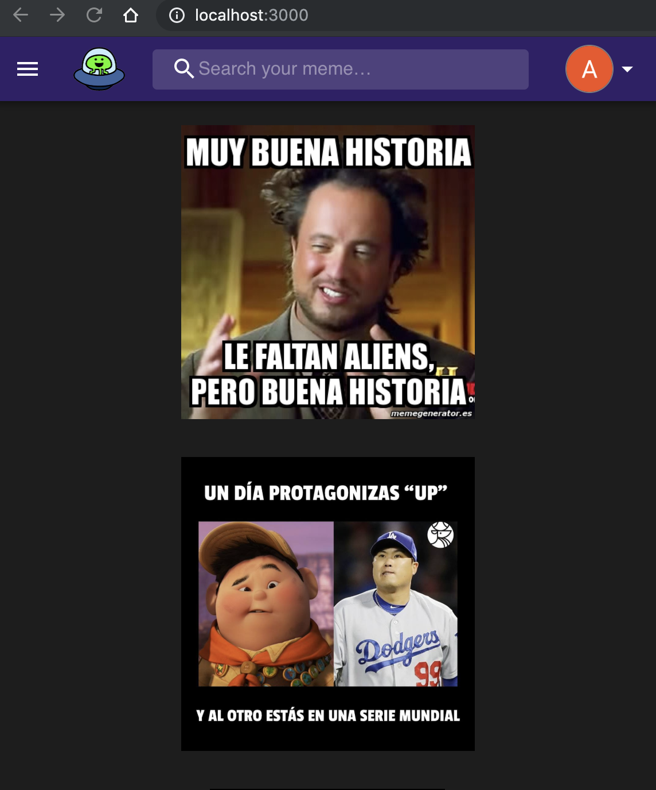
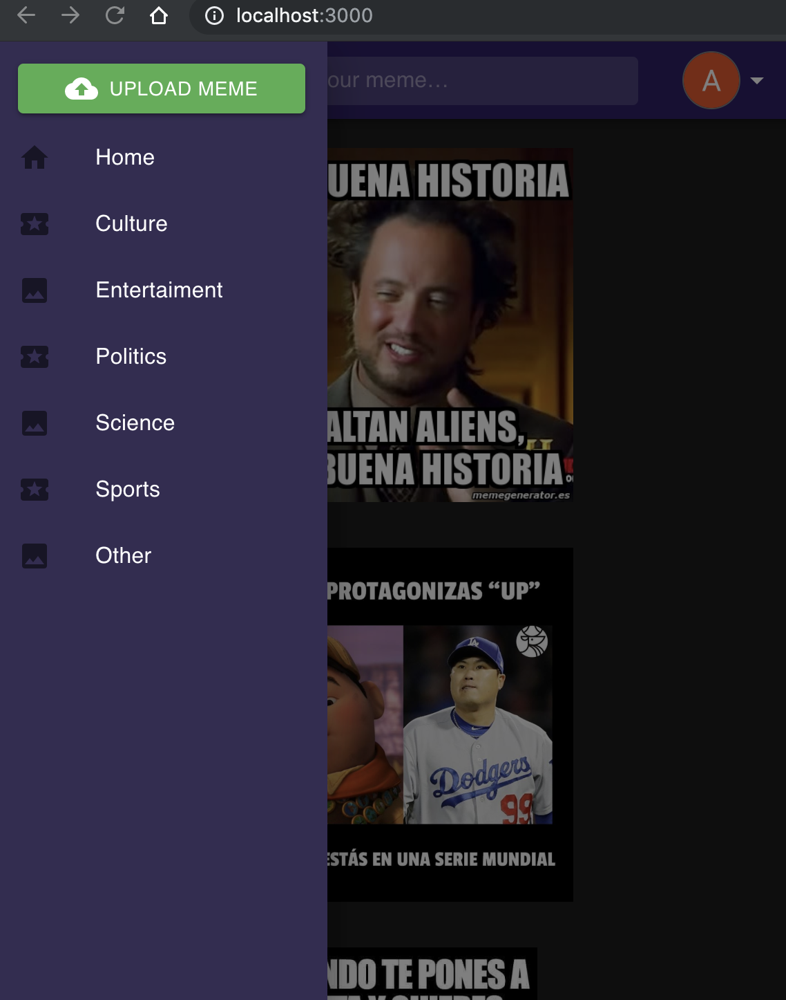
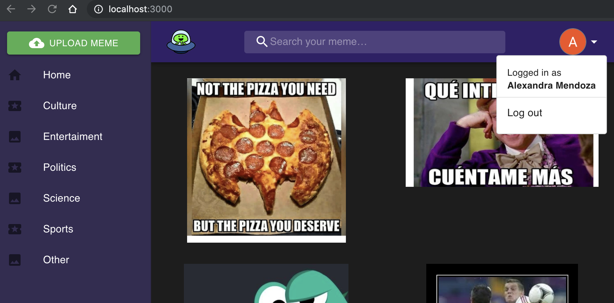

# Memes App

#### This project is a website to learn React JS with Firebase, thanks to the developer Hector BlisS following his video on [Youtube](https://www.youtube.com/watch?v=T42L0QULzM4).

---

### Home

  <kbd>
    
  </kbd>

 

#

### Login with gmail

  <kbd>
    
  </kbd>
   

#

### Home with user logged

  <kbd>
    
  </kbd>
   

#

### Categories

  <kbd>
    
  </kbd>
   

#

### Search

  <kbd>
    
  </kbd>
   

#

### Upload

  <kbd>
    
  </kbd>
   

#

### Responsive

  <kbd>
    
  </kbd>
   
  <kbd>
    
  </kbd>
   

#

### Log out

  <kbd>
    
  </kbd>
   
  

